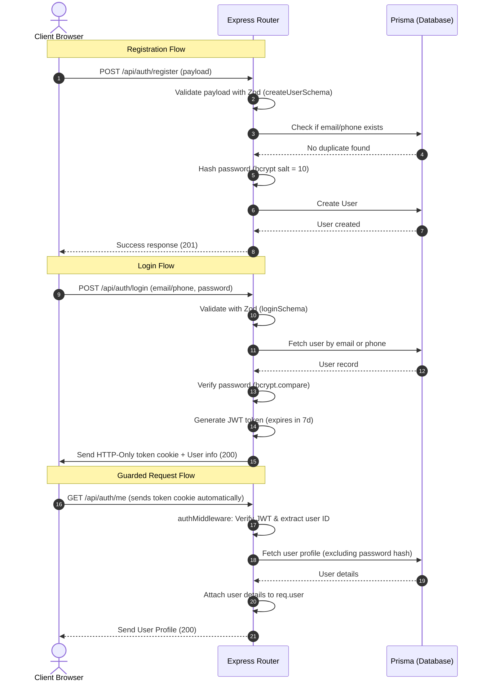

# Backend Authentication Flow & Architecture

This document explains the authentication, session management, validation, and authorization mechanisms implemented in the backend of **Together-Buying**.

---

## 1. Overview of the Flow

The authentication architecture is built on top of **Node.js/Express**, **Prisma (SQLite)**, **JSON Web Tokens (JWT)**, and **Zod** schema validations. It uses **HTTP-Only Cookies** for secure session storage to prevent Cross-Site Scripting (XSS) attacks.



---

## 2. API Endpoints

All authentication routes are prefixed with `/api/auth` (mounted in `src/app.ts`).

| Method | Endpoint | Middleware | Description |
|:---|:---|:---|:---|
| **POST** | `/register` | None (Zod Validation) | Registers a new user account. Hashes password using bcrypt. |
| **POST** | `/login` | None (Zod Validation) | Verifies credentials, signs JWT, and issues an HTTP-Only session cookie. |
| **POST** | `/logout` | None | Clears the HTTP-Only session cookie immediately. |
| **GET** | `/me` | `isAuthenticated` | Verifies the session cookie and returns the active user profile. |

---

## 3. Detailed Components

### 3.1 Input Validation (Zod Schemas)
Before requests hit the database or controllers, they are validated against Zod schemas in [auth.schemas.ts](file:///Users/samarthsharma/Documents/together-buying/Backend/src/schemas/auth.schemas.ts):
- **`createUserSchema`**:
  - `firstName` & `lastName`: Minimum of 3 characters.
  - `email`: Enforces standard email format.
  - `phone`: Enforces exactly 10 numeric characters.
  - `password`: Enforces a minimum length of 8 characters.
- **`loginSchema`**:
  - Accept `email` (optional) and/or `phone` (optional), and `password` (minimum 8 characters).
  - Uses `.refine()` to ensure that at least one identifier (`email` or `phone`) is provided for authentication.

### 3.2 Password Hashing (Bcrypt)
During registration:
- Raw passwords are never stored in the database.
- They are processed using `bcrypt.hash(password, 10)` which generates a secure, one-way hash using 10 salt rounds.
- During login, `bcrypt.compare(password, user.password)` checks the submitted password against the stored hash.

### 3.3 JWT Session Issuance & Security
Upon successful login:
- A token is signed with a payload of `{ id: user.id }`.
- The token is signed using `JWT_SECRET` (configured via environment variables, falling back to a hardcoded string if missing).
- The token is written directly to the client's cookies using Express `res.cookie()`:
  - **`httpOnly: true`**: Protects the cookie from being read by client-side JavaScript (mitigating XSS theft).
  - **`secure: process.env.NODE_ENV === "production"`**: Dictates that the cookie is only transmitted over secure HTTPS connections in production.
  - **`sameSite: "strict"`**: Restricts the cookie from being sent in cross-site requests, providing robust protection against Cross-Site Request Forgery (CSRF).
  - **`maxAge: 7 days`** (7 * 24 * 60 * 60 * 1000 milliseconds).

---

## 4. Route Guards & Role-Based Middleware

Authorization is handled modularly using middlewares located in [auth.middleware.ts](file:///Users/samarthsharma/Documents/together-buying/Backend/src/middlewares/auth.middleware.ts):

### 4.1 Authentication Guard (`isAuthenticated`)
- Checks for the presence of the `token` cookie inside `req.cookies`.
- If the token is missing, throws a `401 Unauthorized` error.
- Decodes the token using `jwt.verify(token, JWT_SECRET)`.
- Queries the Prisma database using the decoded user ID:
  - Selects only necessary fields (`id`, `email`, `phone`, `role`, `firstName`, `lastName`) to avoid pulling sensitive hashes unnecessarily.
- Appends the fetched user information to the Express request object as `req.user`, allowing downstream route handlers to access the current session user.

### 4.2 Role-Based Guard (`authorizedRoles`)
A factory function that builds permission layers:
```typescript
export const authorizedRoles = (...roles: Array<"USER" | "BUYER_PREMIUM" | "RM" | "ADMIN" | "SUPER_ADMIN">) => 
  async (req: AuthenticatedRequest, res: Response, next: NextFunction) => {
    const currentUserRole = req.user?.role;
    if (!currentUserRole || !roles.includes(currentUserRole)) {
      return next(new AppError("You do not have permission to access this route", 403));
    }
    next();
  }
```
*Example usage in routing:*
```typescript
// Only Admins or Super Admins can access administrative developer endpoints
router.post("/create", isAuthenticated, authorizedRoles("ADMIN", "SUPER_ADMIN"), createDeveloper);
```

---

## 5. Error Handling Lifecycle

All auth controllers are wrapped with a `tryCatch` utility. If any validation fails (e.g., duplicate email check) or a database issue occurs:
1. The exception is caught and forwarded to Express's built-in error pipeline via `next(error)`.
2. The central [error.middleware.ts](file:///Users/samarthsharma/Documents/together-buying/Backend/src/middlewares/error.middleware.ts) intercepts the exception.
3. It formats the response JSON cleanly containing:
   - `success: false`
   - `message` (e.g. "User with this email or phone already exists")
   - `stack` (included for development debugging)
4. Sends the correct HTTP status code (e.g., `400 Bad Request`, `401 Unauthorized`, `403 Forbidden`, `404 Not Found`).
