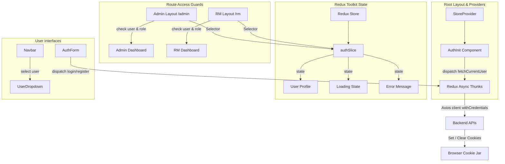

# Frontend Authentication & Role-Based Access Guide

This document details the frontend authentication flow, global state management, and route guarding implemented in the **Together-Buying** Next.js application using **Redux Toolkit** and **Axios**.

---

## 1. Architecture Overview



Authentication state is centralized inside a **Redux Store**, replacing standard React contexts. This ensures predictable state transitions and type safety across pages.

---

## 2. Key Directories & File Structure

All auth files are modularly located in the following structures:
- **Store Configuration:**
  - [store/index.ts](file:///Users/samarthsharma/Documents/together-buying/Frontend/src/store/index.ts): Sets up the store, exports pre-typed store hooks parameters.
  - [store/hooks.ts](file:///Users/samarthsharma/Documents/together-buying/Frontend/src/store/hooks.ts): Exports typed hook wraps `useAppDispatch` and `useAppSelector` to prevent typing redundancy.
- **State Slices:**
  - [store/slices/authSlice.ts](file:///Users/samarthsharma/Documents/together-buying/Frontend/src/store/slices/authSlice.ts): Defines types, slice state, reducers, and async thunk queries.
- **App Mounting & Bootstrapping:**
  - [store/StoreProvider.tsx](file:///Users/samarthsharma/Documents/together-buying/Frontend/src/store/StoreProvider.tsx): Client-side wrapper around Redux `<Provider />`.
  - [components/auth-init.tsx](file:///Users/samarthsharma/Documents/together-buying/Frontend/src/components/auth-init.tsx): Automatically restores JWT user details from HTTP-Only cookies on page load.

---

## 3. Redux Authentication Slice (`authSlice`)

The authentication state is defined as:
```typescript
interface AuthState {
  user: User | null;
  loading: boolean; // Boot session checks defaults to true
  error: string | null;
}
```

### 3.1 Async Thunks & Operations

All thunk calls invoke backend requests configured with a unified Axios client (`withCredentials: true`):

1. **`fetchCurrentUser`**:
   - Dispatched on application boot.
   - Hits `GET /api/auth/me`.
   - Populates `state.user` if valid cookies are found, resolving the loading flag.
2. **`loginUser`**:
   - Takes `{ email/phone, password }` payloads.
   - Hits `POST /api/auth/login`.
   - Stores the returned user profile inside state.
3. **`registerUser`**:
   - Takes `{ firstName, lastName, email, phone, password }` payloads.
   - Hits `POST /api/auth/register` to register the credentials.
4. **`logoutUser`**:
   - Dispatched on logout.
   - Hits `POST /api/auth/logout`.
   - Resets state to default `null` state values.

---

## 4. Next.js App Router Provider Strategy

Since Next.js layout templates are **Server Components** by default, they cannot directly mount React-Redux `<Provider>` layouts. We solve this using a two-step Client Component registration:

1. **`StoreProvider.tsx`** encapsulates client-side providers:
   ```tsx
   "use client";
   import { Provider } from "react-redux";
   import { store } from "./index";
   
   export function StoreProvider({ children }: { children: React.ReactNode }) {
     return <Provider store={store}>{children}</Provider>;
   }
   ```
2. **`AuthInit.tsx`** triggers initial cookie restoration on mount:
   ```tsx
   "use client";
   import { useEffect } from "react";
   import { useAppDispatch } from "@/store/hooks";
   import { fetchCurrentUser } from "@/store/slices/authSlice";
   
   export function AuthInit() {
     const dispatch = useAppDispatch();
     useEffect(() => {
       dispatch(fetchCurrentUser());
     }, [dispatch]);
     return null;
   }
   ```
3. Both are loaded inside **[layout.tsx (Root Layout)](file:///Users/samarthsharma/Documents/together-buying/Frontend/src/app/layout.tsx)**:
   ```tsx
   export default function RootLayout({ children }) {
     return (
       <html lang="en">
         <body>
           <StoreProvider>
             <AuthInit />
             <Navbar />
             {children}
           </StoreProvider>
         </body>
       </html>
     );
   }
   ```

---

## 5. Route Protection & Role Access Guards

To shield routes, Next.js layouts evaluate the current Redux authentication state.

### 5.1 Admin Access Guard (`/admin`)
- Located in **[layout.tsx (Admin Layout)](file:///Users/samarthsharma/Documents/together-buying/Frontend/src/app/admin/layout.tsx)**.
- Listens to `state.auth` updates:
  ```typescript
  const user = useAppSelector((state) => state.auth.user);
  const loading = useAppSelector((state) => state.auth.loading);
  ```
- **Loading Phase:** Renders a premium backdrop loading spinner while cookie sessions are fetched.
- **Validation Phase:** If `loading === false` and no user exists, or the user's role is not `ADMIN` or `SUPER_ADMIN`, they are redirected instantly to `/login`.

### 5.2 Relationship Manager Guard (`/rm`)
- Located in **[layout.tsx (RM Layout)](file:///Users/samarthsharma/Documents/together-buying/Frontend/src/app/rm/layout.tsx)**.
- Same guard structure checks the `RM` role before exposing group milestones and buyer pipelines, redirecting unauthorized traffic back to `/login`.

---

## 6. Components Bindings

### 6.1 Authentication Form (`AuthForm`)
- Integrates both login and registration tabs inside a single dynamic card.
- Manages an internal state `submitting` to decouple page actions from global loading states (preventing submit buttons showing "Please wait..." on load while background cookie checks take place).
- Triggers dynamic redirection based on database role:
  - `ADMIN` / `SUPER_ADMIN` $\rightarrow$ `/admin/dashboard`
  - `RM` $\rightarrow$ `/rm/dashboard`
  - Other users $\rightarrow$ `/`

### 6.2 Profile Navigation (`UserDropdown`)
- Mounted automatically inside the header Navbar upon successful authentication.
- Displays user profile summaries, initials avatars, and lists context-specific links matching user roles (e.g. shortcuts to administrative tools or RM desk portals).
- Houses the main logout button which resets Redux slices and returns the browser to the main page `/`.
